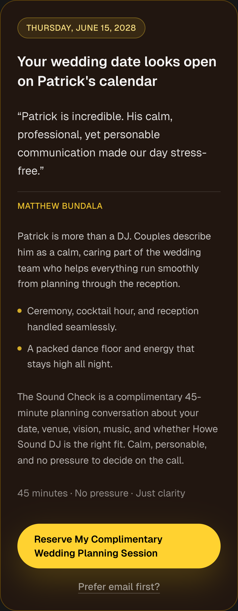
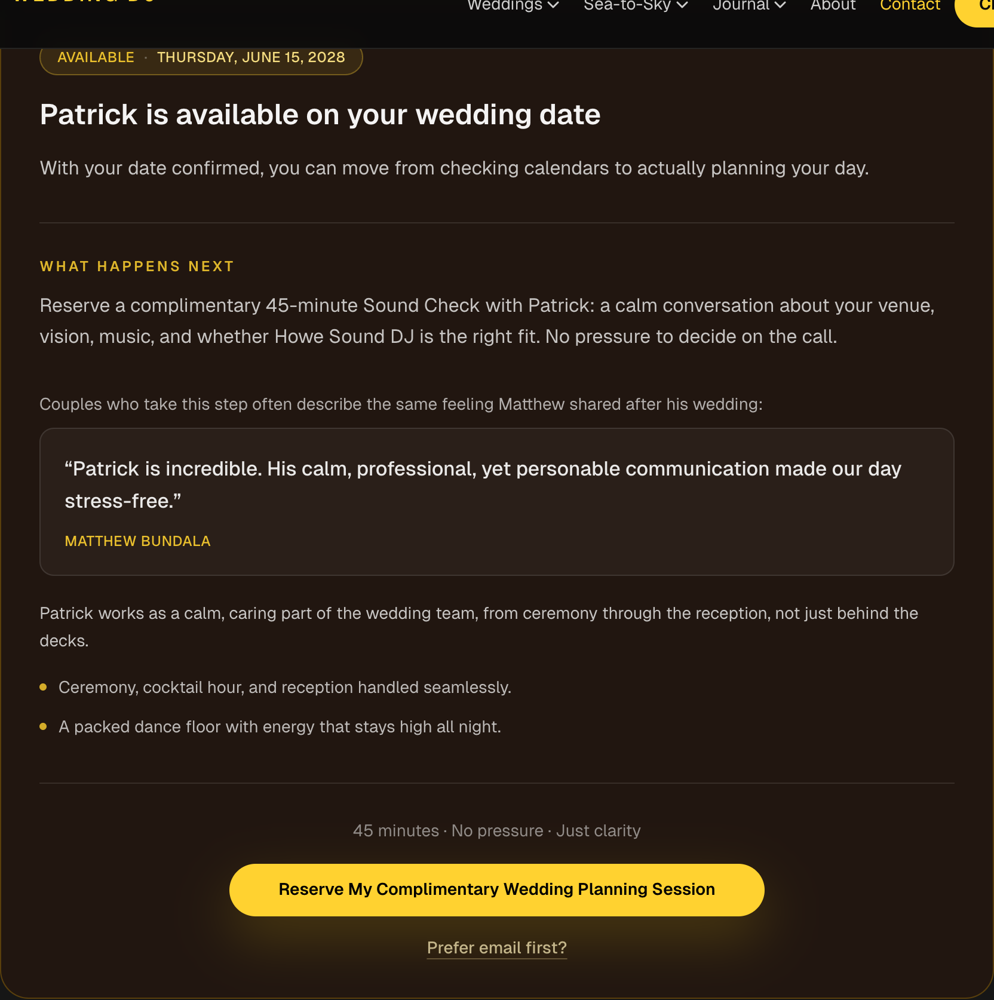
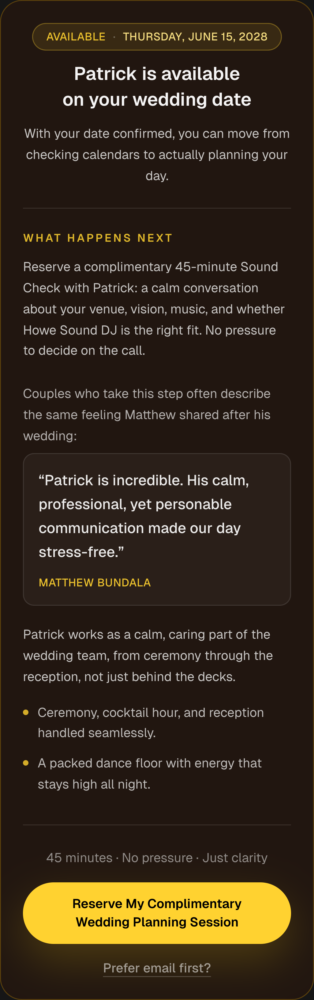
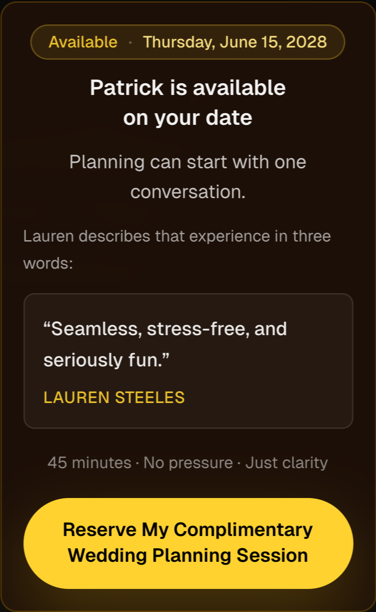

# HSDJ-WEB-AVAILABILITY-SUCCESS-V2 — Experience Handoff

**Date:** 2026-07-29  
**Terminal verdict:** `PASS_IMPLEMENTATION_COMPLETE_PRODUCTION_PROOF_REQUIRED`  
**Authority inputs:** Brand DNA V1, Emotional Conversion Engine V1, HSWEF V1, Conversion & Latency Handoff 01

---

## Executive Summary

**MISSION:** Transform the post-availability success state from a successful software response into the emotional beginning of a couple's wedding journey.

**OUTCOME:** `PostAvailabilitySuccess` now follows a five-act emotional sequence (Relief → Excitement → Confidence → Trust → Action) with a coherent narrative, contextualized social proof, and centered primary CTA. Headline hedging ("looks open") is replaced with confident, Patrick-forward confirmation.

**COPY VARIANT:** `patrick_available_v2` (analytics `copy_variant` property updated; contract unchanged)

**SCOPE RESPECTED:** No changes to availability API, HSDJ Operations integration, latency implementation, analytics event names, or review SSOT ownership.

---

## Current UX Findings (V1 audit)

| Element | Purpose | Emotional contribution | Conversion contribution | Confusion risk | Visual priority | V2 action |
|---------|---------|------------------------|-------------------------|----------------|-----------------|-----------|
| Date chip (date only) | Confirm selection | Relief (weak) | Low | Low | Medium | Add **Available** prefix |
| Headline "looks open" | Confirm availability | Relief (hedged) | Medium | Medium — sounds tentative | High | **Replace** — confident, Patrick-forward |
| Testimonial (abrupt) | Social proof | Trust (disconnected) | Medium | **High** — why is this here? | Medium-high | **Reframe** with transition line |
| Identity + bullets | Differentiation | Confidence | Medium | Low | Medium | Move **after** proof, post-context |
| Sound Check paragraph | Next step | Confidence | High | Low | Buried | **Elevate** under "What happens next" |
| Risk reducer | De-risk CTA | Reassurance | High | Low | Low | Move **above** CTA, centered |
| CTA | Conversion | Action | High | Low | High | **Center** with flex + max-width |
| Inquiry fallback | Escape hatch | Neutral | Low | Low | Low | Keep, centered |

**Removed:** Nothing functional removed (V1 already eliminated dual CTAs and escape links in Conversion 01).

**Reordered:** Narrative sequence restructured; testimonial no longer interrupts headline → action flow.

---

## Psychological Audit

### V1 emotional sequence (broken)

```
Relief (hedged headline) → Trust? (random quote) → Identity → Planning copy → Action
                              ↑ excitement missing
                              ↑ confidence buried
```

### V2 emotional sequence (intended)

| Act | Stage | Elements |
|-----|-------|----------|
| 1 | **Relief** | `Available · {date}` chip |
| 2 | **Excitement** | Headline + excitement bridge ("planning can start") |
| 3 | **Confidence** | "What happens next" + Sound Check explanation (full only) |
| 4 | **Trust** | Proof transition + testimonial panel + identity + outcomes |
| 5 | **Action** | Risk reducer + centered CTA (+ email fallback full only) |

Every visible element maps to exactly one act.

---

## Headline Evaluation Matrix

| Criterion | A: Patrick Available | B: Date Confirmed | C: Great Start | D: Calendar Open (V1) |
|-----------|----------------------|-------------------|----------------|-----------------------|
| Clarity | 5 | 5 | 4 | 4 |
| Energy | 5 | 3 | 4 | 3 |
| Memorability | 5 | 3 | 4 | 4 |
| Confidence | 5 | 5 | 3 | 3 (hedging) |
| Premium feel | 5 | 4 | 3 | 4 |
| **TOTAL** | **25** | **20** | **18** | **18** |

### Winning Headline

| Surface | Headline |
|---------|----------|
| **Full** | Patrick is available on your wedding date |
| **Compact** | Patrick is available on your date |

**Rationale:** Names Patrick immediately (path to "I want to meet Patrick"), confirms availability without hedging, evidence-safe (availability check is authoritative).

---

## Testimonial Strategy

### V1 problem

Quote appeared immediately after headline with no bridge. Visitor asks: *Why am I reading this now?*

### V2 solution

| Surface | Transition copy | Proof | Why it works |
|---------|-----------------|-------|--------------|
| Full | "Couples who take this step often describe the same feeling Matthew shared after his wedding:" | Matthew Bundala verbatim | Links proof to **next step** (Sound Check), not random praise |
| Compact | "Lauren describes that experience in three words:" | Lauren Steeles compact excerpt | Ultra-brief; ties quote to **planning conversation** |

Testimonial rendered in nested panel (`border-white/10`, `bg-white/[0.04]`) to signal "evidence block" distinct from narrative copy.

Identity statement and outcome bullets follow proof as **interpretation**, not interruption.

---

## Visual Hierarchy Changes

| Element | V1 | V2 |
|---------|----|----|
| Date chip | Date only | **Available ·** date, centered mobile |
| Headline | Below chip, left | Centered mobile, `text-balance` |
| Section breaks | None | Border dividers before Confidence and Action |
| Proof | Inline blockquote | Transition line + nested panel |
| CTA container | Left-aligned `sm:w-auto` | `flex justify-center`, `max-w-md`, full width |
| CTA typography | Default padding | `leading-snug`, `py-3.5` mobile for wrap balance |
| Compact density | Quote before context | Bridge → proof panel → action |

---

## Microcopy Decisions

| Field | V2 copy | Rationale |
|-------|---------|-----------|
| `excitementBridge` (full) | With your date confirmed, you can move from checking calendars to actually planning your day. | First wedding moment without gimmicks |
| `nextStepHeading` | What happens next | Answers implicit "now what?" |
| `soundCheckExplanation` | Reserve a complimentary 45-minute Sound Check with Patrick: a calm conversation… | Names Patrick; colon not em dash (style rule) |
| `proofTransition` (full) | Couples who take this step often describe… | Elegant bridge to Matthew |
| `proofTransition` (compact) | Lauren describes that experience in three words: | Compact proof framing |
| `identityStatement` | …calm, caring part of the wedding team, from ceremony through reception… | Evidence-aligned; comma not em dash |

**Unchanged:** Primary CTA label, risk reducer, inquiry fallback, SR status templates, unavailable/manual copy.

---

## Mobile Validation

| Viewport | Surface | Result |
|----------|---------|--------|
| 390×844 | Full contact | PASS — headline wraps cleanly; CTA two-line wrap balanced; no cramping |
| 375×812 | Compact header panel | PASS — narrative fits panel; CTA full width centered |
| 1280×900 | Full contact | PASS — left-aligned header on sm+, centered action block |

---

## Files Changed

| File | Change |
|------|--------|
| `src/config/post-availability-copy.ts` | V2 narrative copy, headline, transitions, `patrick_available_v2` variant |
| `src/components/post-availability-success.tsx` | Five-act layout, hierarchy, centered CTA, proof panel |
| `tests/post-availability-conversion.test.ts` | V2 headline + narrative sequence tests |
| `scripts/capture-availability-success-v2.mjs` | One-off screenshot utility (not production) |
| `docs/handoff/screenshots/availability-success-v2/*.png` | Browser proof captures |

**Not changed:** `route.ts`, `availability-check-client.ts`, `analytics.ts`, `reviews.ts`, `post-availability-calendly.ts`, `post-availability-analytics.ts` (structure only; `copy_variant` value updates via copy SSOT).

---

## Validation Results

| Check | Result |
|-------|--------|
| `npm run typecheck` | PASS |
| `npm run lint` | PASS |
| `npm test` | PASS (65 tests) |
| `npm run build` | PASS |

### Manual browser proof

| Check | Result |
|-------|--------|
| Desktop full success | PASS — screenshot captured |
| Mobile 390 full | PASS — screenshot captured |
| Mobile 375 compact | PASS — screenshot captured |
| Testimonial context understood | PASS — transition line present |
| Headline memorable | PASS — Patrick-forward, no hedging |
| CTA centered | PASS |
| Visual hierarchy improved | PASS — section dividers + proof panel |

---

## Before/After Screenshots

### V1 (before) — mobile 390



**V1 issues visible:** Headline hedges ("looks open"); testimonial appears immediately after headline with no bridge; Sound Check buried below identity/bullets; CTA left-aligned on desktop.

### V2 (after) — desktop 1280



### V2 (after) — mobile 390



### V2 (after) — compact mobile 375



---

## Remaining Opportunities

1. **Patrick review:** Final approval on headline tone and proof transition phrasing.
2. **Production deploy:** Re-capture screenshots on production after deploy.
3. **A/B measurement:** Compare `copy_variant` `calendar_open_v1` vs `patrick_available_v2` via `post_availability_success_view` → `book_consult_click` funnel (if historical data exists post-deploy).
4. **Calendly prefill:** Optional future tranche if Calendly admin supports custom questions.
5. **Experience Arc Summary:** HSWEF Stage 2 couple-facing deliverable after Sound Check (separate tranche).

---

## Final Verdict

`PASS_IMPLEMENTATION_COMPLETE_PRODUCTION_PROOF_REQUIRED`

The availability success experience now tells one coherent story: your date is confirmed, planning can begin, here is what happens next, here is why couples trust Patrick, here is how to take the first step. The emotional shift from *"I checked my date"* toward *"I've just taken the first exciting step toward an amazing wedding"* is materially stronger than V1.

Production deploy and Patrick screenshot approval remain before declaring production proof complete.

---

## Emotional sequence reference

```
Available · {date}
        ↓ Relief
Patrick is available on your wedding date
        ↓ Excitement
With your date confirmed…
        ↓ Confidence
What happens next → Sound Check explanation
        ↓ Trust
Proof transition → Matthew/Lauren → identity → outcomes
        ↓ Action
45 minutes · No pressure · Just clarity → [Reserve CTA]
```
